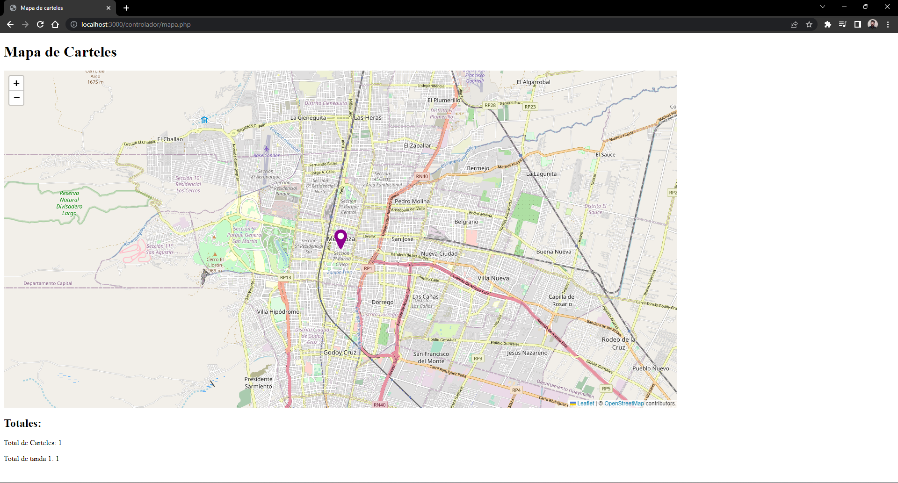
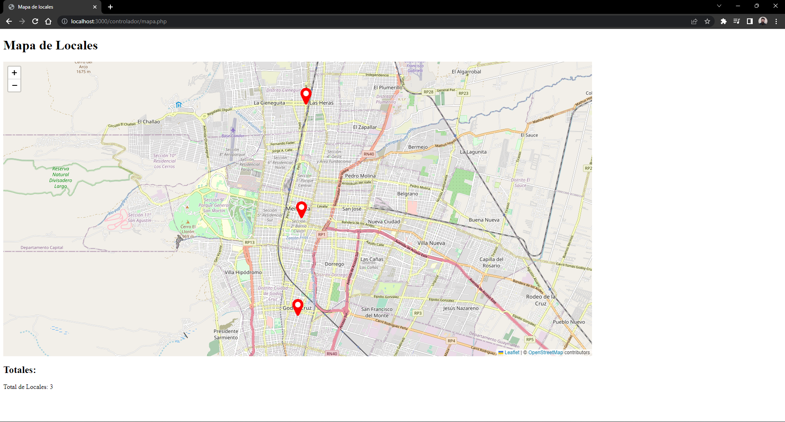
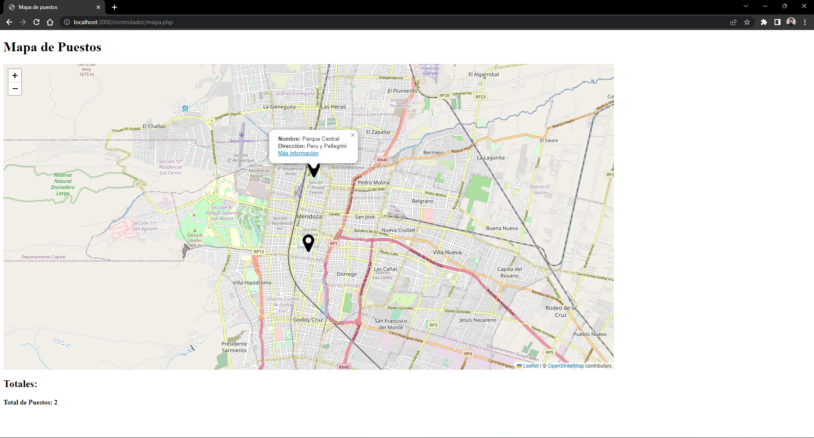

# Marcadores (ES)
Este sistema ha sido diseñado para crear marcadores en una base de datos que luego serán mostrados sobre un mapa centrado en un punto en particular.

El sistema cuenta con tres tipos de usuarios: Usuarios comunes, Usuarios de consulta y Administradores.

Desde el panel de inicio se pueden crear dos tipos de marcadores distintos desde formularios que impactan en tablas distintas de la base de datos. El formulario solicita al usuario la dirección, solicita la ubicación del navegador y permite subir una foto del marcador para ser guardada en el sistema.

Por su parte, el mapa puede mostrar tres tipos de marcadores, cada uno con un marcador de distinto color, siendo posible crear el tercero de ellos únicamente desde la base de datos. La categoría a mostrar se elige desde el panel de usuario después de iniciar sesión. Cada marcador muestra un popup con la información propia de su categoría, la cual es tomada de la base de datos y debajo del mapa se muestra un contador de la cantidad de marcardores.

Además hay también una página para la administración de usuarios que permite activar cuentas recientemente registradas, resetear contraseñas y transformar usuarios comunes en administradores.

Los usuarios comunes tienen acceso solamente a los formularios, los usuarios de consulta tienen acceso solamente al mapa y los administradores pueden acceder a todas las áreas.

El sistema cuenta con un formulario de registro, un formulario para solicitar el reinicio de la contraseña y un cierre de sesión por inactividad.

# Markers (EN)
This app has been developed to create markers in a database that will then be displayed on a map centered on a particular point.

The system has three types of users: Regular users, Consultation users and Administrators.

From the dashboard it can create two different types of markers, each with a marker of a different color, from forms that impact different tables in the database. The form asks the user for the address, requests the location of the browser and allows uploading a photo of the marker to be saved in the system.

For its part, the map can show three types of markers, and it is possible to create the third one only from the database. The category to display is chosen from the user panel after logging in. Each marker shows a popup with the information of its category, which is selected from the database, and a counter of the number of markers is shown below the map.

Also, there is also a page for user management that allows to activate newly accounts, reset passwords and turn a regular user into an admin.

Regular users have access only to the forms, Consultation users have access only to the map, and Admins can access all areas.

The system has a registration form, a password reset request form, and a logout for inactivity.

# Tecnologías / Tech:
* <b>Front-end:</b> HTML
* <b>Back-end:</b> PHP 8
* <b>Manejo de Base de Datos:</b> MySQL 8
* <b>Mapa:</b> Leaflet API + OpenStreetMap layer

# Screenshots

  

  

  

  

  

  
