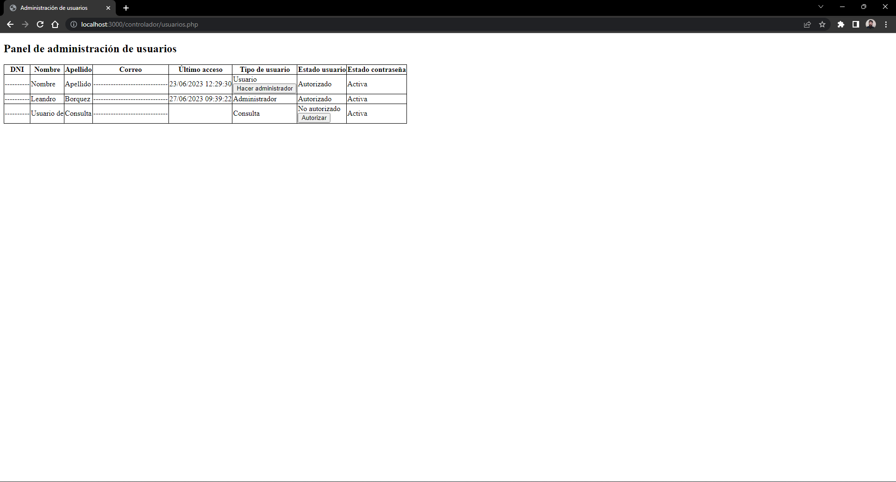

# Marcadores (ES)
Este sistema ha sido diseñado para crear marcadores en una base de datos que luego serán mostrados sobre un mapa centrado en un punto en particular.

Los usuarios del sistema pueden crear dos tipos de marcadores distintos desde formularios que impactan en tablas distintas de la base de datos. El formulario solicita al usuario la dirección, solicita la ubicación del navegador y permite subir una foto del marcador para ser guardada en el sistema.

Por su parte, el mapa puede mostrar tres tipos de marcadores, siendo posible crear el tercero de ellos únicamente desde la base de datos. La categoría a mostrar se elige desde el panel de usuario después de iniciar sesión. El mapa se encuentra visible solamente para administradores.

Además del formulario de inicio de sesión, el sistema cuenta con un formulario de registro, un formulario para solicitar el reinicio de la contraseña y un cierre de sesión por inactividad.

# Markers (EN)
This app has been developed to create markers in a database that will then be displayed on a map centered on a particular point.

Users can create two different types of markers from forms that impact different tables in the database. The form asks the user for the address, requests the location of the browser and allows uploading a photo of the marker to be saved in the system.

For its part, the map can show three types of markers, and it is possible to create the third one only from the database. The category to display is chosen from the user panel after logging in. The map is only visible to administrators.

In addition to the login form, the system has a registration form, a password reset request form, and a logout for inactivity.

# Tecnologías / Tech:
* <b>Front-end:</b> HTML
* <b>Back-end:</b> PHP 8
* <b>Manejo de Base de Datos:</b> MySQL 8
* <b>Mapa:</b> Leaflet API + OpenStreetMap layer

# Screenshots

  

  

  
